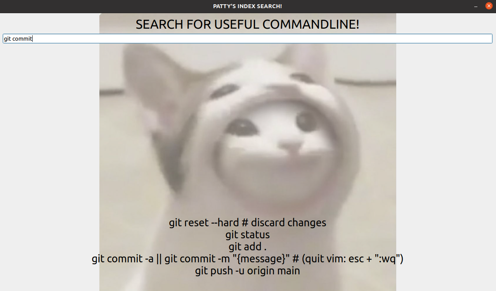

## My Personal Searching Engine
### Yes, I am that boring - I built a small GUI APP to automate the process of looking up some common commandlines LMAO.

Basically, the app could take it some keywords, and spit out the commandline that I need. Something like this:




If you want to give it a go, you can download this package and do:
```
./popcat
```
You will not need any external files to run this, I have embedded everything within it.

Or, you can build it with cmake (you will need QT5 lib, make sure that you download that beforehand):
```
cd build && cmake .. && make
# for mac -> cmake -DQt5_DIR=$(brew --prefix qt@5)/lib/cmake/Qt5 ..
```

### Things to do
Currently, the indexing is not robust enough, and I did not apply any fancy algorithm to conduct the searching nor did I design a super cool data structure. Will do it if I got time. Currently, it is just for my own convenience. 